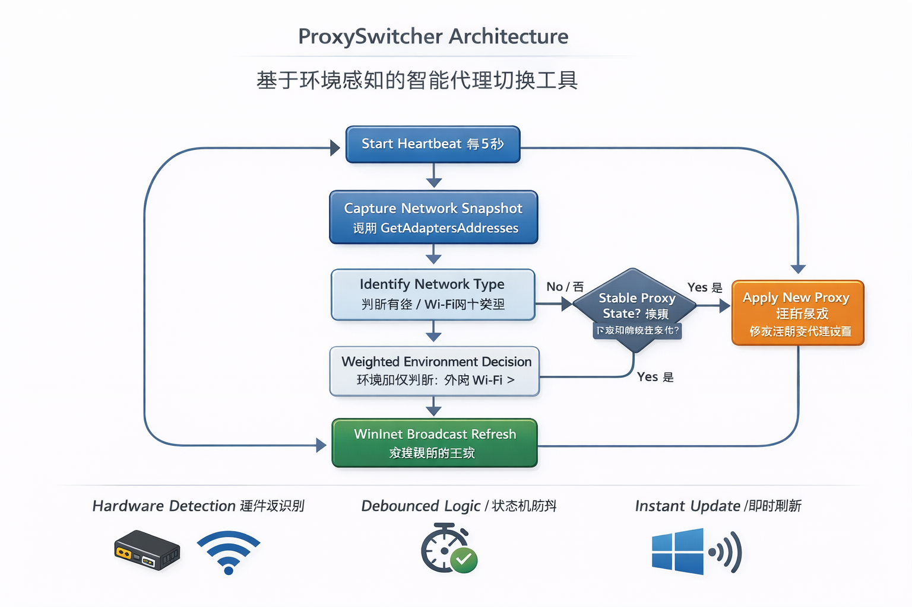

ProxySwitcher
=============

> Windows 智能代理自动切换工具（基于环境感知的状态机）

* * *

✨ 这是什么？
-------

**ProxySwitcher** 是一个运行在 Windows 后台的工具，用于根据**真实网络环境**自动开启或关闭系统代理。

适用于以下场景：

*   插着 **公司有线网（10.x.x.x）**
*   同时连着 **手机热点 / 家庭 Wi-Fi**
*   不想再手动来回切代理

* * *

🚀 它解决了什么问题？
------------

Windows 经常会：

*   选错代理
*   GitHub 上不去
*   公司内网连不上

**ProxySwitcher 会自动帮你做正确的选择。**

* * *

🧠 核心思路
-------

*   硬件级网卡识别（不是看名字）
*   状态机 + 防抖判断（不因抖动乱切）
*   注册表修改 + WinInet 广播（立即生效）
*   安全退出，自动恢复环境

> **不改路由，不碰 VPN，只做一件事：管好系统代理。**

* * *

🏗 工作流程（简化）
-----------

```
网络变化
   ↓
环境识别（有线 / Wi-Fi）
   ↓
连续一致性校验
   ↓
开启 / 关闭代理
   ↓
浏览器立即生效
```

* * *
## 架构概览




* * *
📦 使用方式
-------

### 构建

```powershell
make debug   # 前台调试
make build   # 后台运行
```

### 命令

| 命令         | 说明                |
| ------------ | ------------------- |
| `-debug`     | 前台运行，输出日志  |
| `-install`   | 安装为 Windows 服务 |
| `-uninstall` | 卸载并清理环境      |

> ⚠ 需 **管理员权限**

* * *

⚙ 配置
----

代理地址当前硬编码在源码中：

```go
const DefaultProxy = "x.x.x.x:x"
```

* * *

📌 适合谁？
-------

*   Windows 开发者
*   经常在公司 / 家里 / 热点之间切换网络
*   讨厌手动改系统代理的人

* * *

📄 License
----------
<a href="./LICENSE">MIT</a>